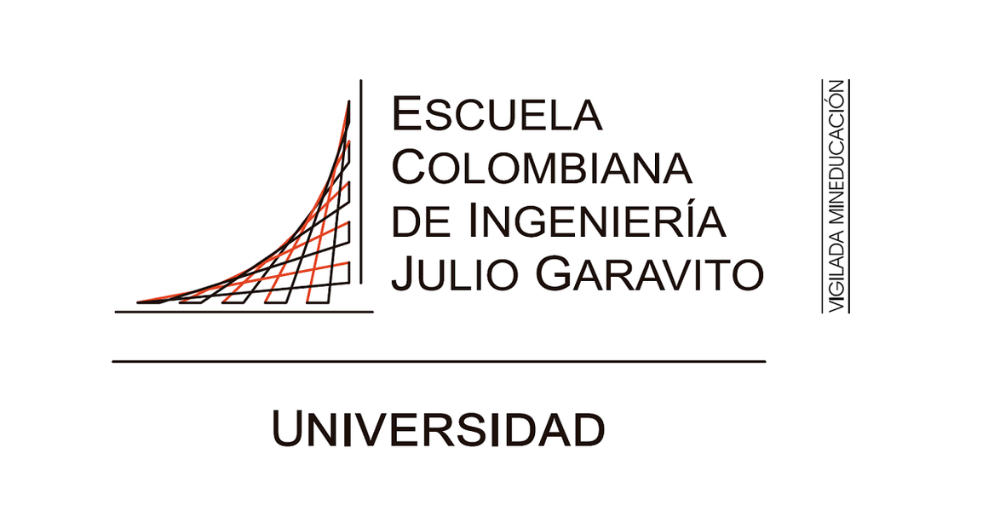

#LABORATORIO 1
##Integrantes:
###Andrea Camila Torres Gonzalez  
###Jorge Andrés Gamboa Sierra 

##Respuestas
1. Owner y Colaborador editan el archivo README.md al mismo tiempo e intentan subir los cambios al mismo tiempo. ¿Que sucedió?
2. ¿Hay una mejor forma de trabajar con git para no tener conflictos?
3. ¿Qué es y como funciona el Pull Request?

