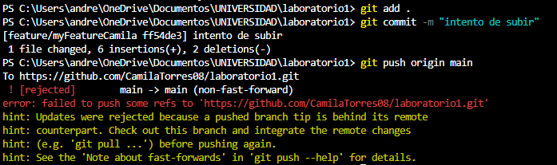

<h1> LABORATORIO 1 </h1>
<h2> Integrantes: </h2>
<h3> Andrea Camila Torres Gonzalez  </h3>
<h3> Jorge Andrés Gamboa Sierra </h3>

## Respuestas
**1. Owner y Colaborador editan el archivo README.md al mismo tiempo e intentan subir los cambios al mismo tiempo. ¿Que sucedió?**

Al haber más de una persona realizando un cambio en el archivo y subirlo al mismo tiempo, el sistema tomó el primer cambio que se subió al main y a la otra persona le generó conflictos.
Notificandole al usuario que debe hacer pull a los cambios, solucionar los conflictos y volverlo a subir.

Estos conflictos generalmente tienen simbolos *<<<* *===* y *>>>* 

La sección que presenta el conflicto se encuentra entre lineas *<<<HEAD ...>>>* y los signos *===* representan los cambios hechos por el usuario al que se le generó el conflicto y los cambios
realizados por la otra persona.

**2. ¿Hay una mejor forma de trabajar con git para no tener conflictos?**

La creación de diferentes ramas es una práctica esencial para gestionar cambios en un proyecto sin alterar la rama principal (main). Estas ramas, conocidas como **feature**, son temporales y su único propósito es permitir que los desarrolladores realicen modificaciones sin afectar el código principal.

Después de que los cambios son aprobados e integrados en la rama principal, es crucial eliminar la rama feature para evitar el almacenamiento de ramas innecesarias que no se volverán a utilizar.

Además, es importante destacar la importancia de ejecutar un pull antes de comenzar a trabajar en cualquier archivo. Esto asegura que la copia local del proyecto esté actualizada con los cambios realizados por otros miembros del equipo, evitando así conflictos y errores en el desarrollo.

**3. ¿Qué es y como funciona el Pull Request?**

# Bibliografía
https://docs.github.com/en/pull-requests/collaborating-with-pull-requests/proposing-changes-to-your-work-with-pull-requests/about-pull-requests

https://codigonaranja.com/como-resolver-conflictos-en-git-y-otros-errores-a-subir-un-cambio#:~:text=Los%20signos%20igual%20%28%3D%3D%3D%3D%3D%3D%3D%29%20separan%20los%20cambios%20hechos,pasos%20%28git%20add.%2C%20git%20commit%20y%20git%20push%29
